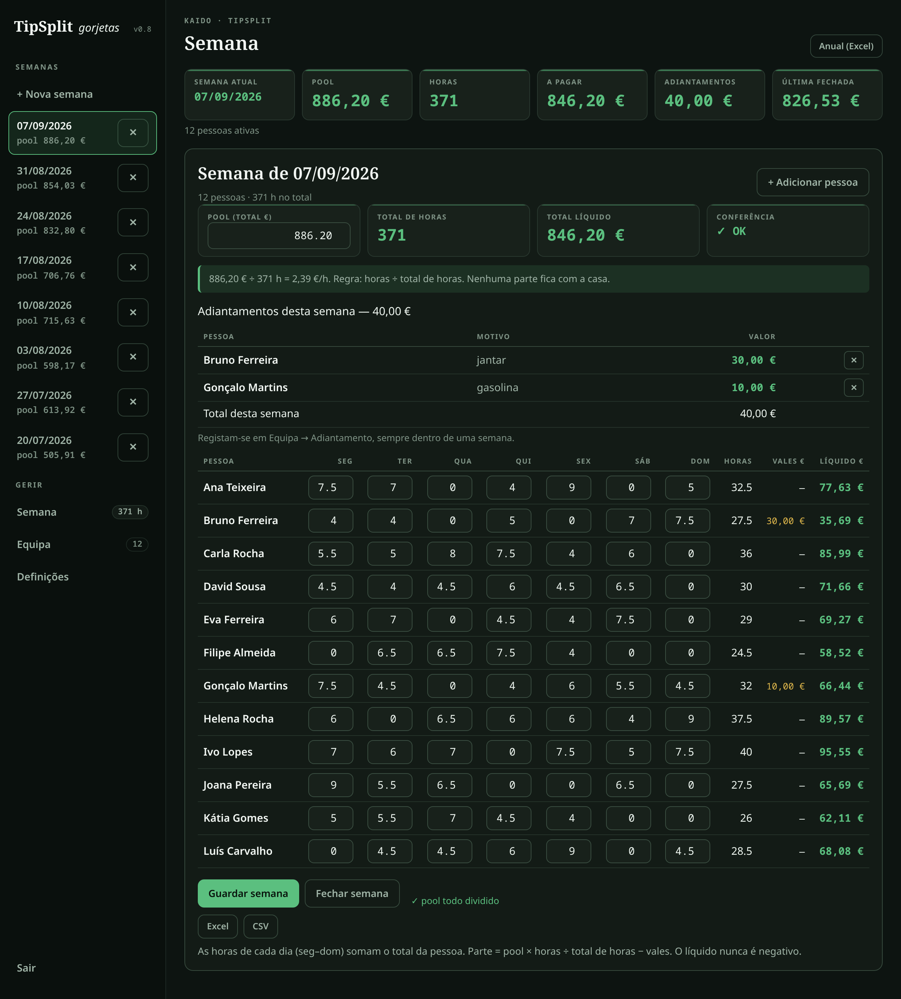
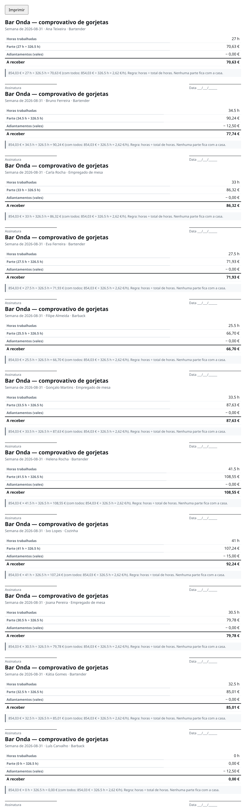
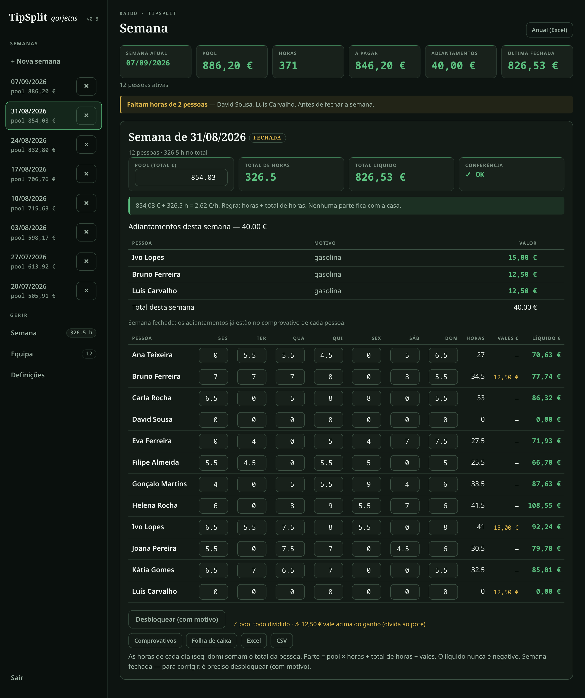
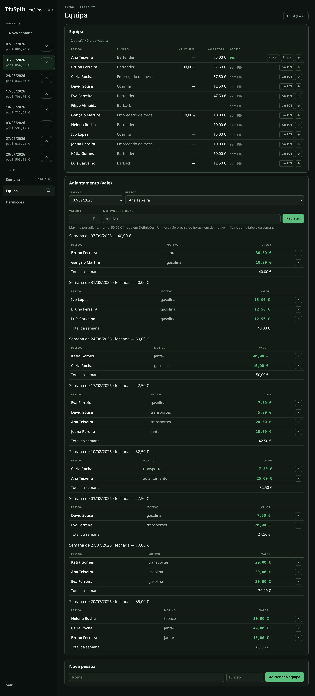
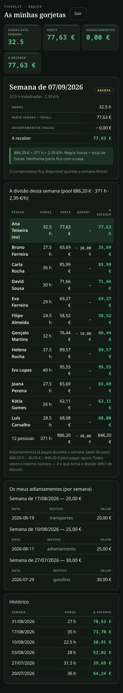
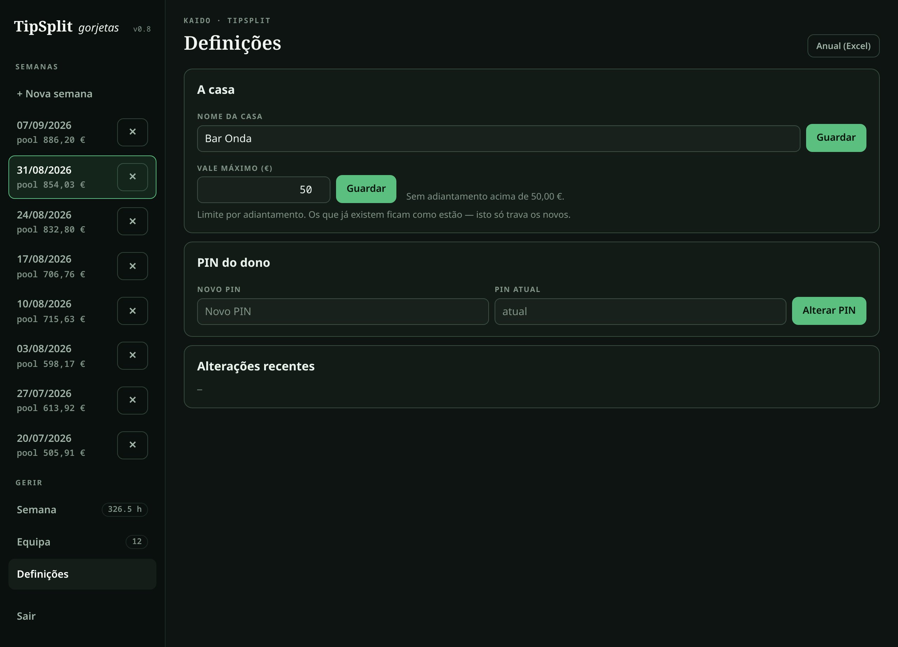

# TipSplit

Weekly tip splitter for **bars, cafés and restaurants** — type the hours, get a split
that nobody argues with, hand out payslips that survive a pocket calculator.

    parte = pool × (horas da pessoa ÷ horas totais) − vales

Built by **Vitor Vareiro.** European Portuguese? Read this in
[Português](README.pt-PT.md).

## Screenshots

| The week — hours in, provable split out | Payday — payslips with the formula on them |
|---|---|
|  |  |
| **A closed week — locked, with the payday files** | **Equipa — roster, PIN state, advances per week** |
|  |  |
| **What the team sees — their own numbers** | **Definições — venue, vale ceiling, audit trail** |
|  |  |

*Desktop and phone captures of the demo dataset — a fictional venue, 8 weeks of history.
Reproduce them exactly with `ops/seed_demo.py` (see Demo bundle).*

## Quick start

```bash
python3 -m venv .venv && .venv/bin/pip install -r requirements.txt
.venv/bin/python -m uvicorn main:app --port 8778      # http://localhost:8778
```

First visit asks you to define the **owner PIN** — and seeds one throwaway week with
fictional staff, so you can play with the split immediately. Real names go in through
the UI.

Want it full of history? Seed the fictional venue (8 weeks, 12 people, advances in
flight, one open week):

```bash
TIPSPLIT_DB=/tmp/tipsplit-demo.db .venv/bin/python ops/seed_demo.py --weeks 8
TIPSPLIT_DB=/tmp/tipsplit-demo.db .venv/bin/python -m uvicorn main:app --port 8791
# owner PIN 1234 · one staff PIN 2468
```

## What it does

- **The week is one screen**: pool in, hours per day (Seg–Dom, 0.5 h steps), advances,
  net out — with a live split as you type. The pool check reads *pool todo dividido*
  when the shares and the pool agree to the cent.
- **The math lives server-side** (`splitting.py`) and the browser only displays it.
  Largest-remainder rounding: everyone floors, the leftover cents are handed out, so the
  shares always add up to the pool. No drifting €0.05 like a spreadsheet.
- **Vales (advances) belong to a week** — never floating. Grouped per week with
  subtotals; the week shows its own advances; nobody needs hours or a motivo to take
  one, and an advance alone puts that person in the week's table (tagged *sem horas*).
- **Vale máximo** — optional ceiling per advance (*Definições*, `0` = no limit),
  enforced server-side, never rewriting advances already recorded.
- **Weeks lock.** A closed week can't be edited and can be printed. Reopening requires a
  **motivo**, which is recorded in the audit trail.
- **Payday paperwork**: payslips per person with the unrounded formula
  (`470,40 € × 32 h ÷ 448 h = 33,60 €`) and a signature line, a cash sheet for the till,
  week export (xlsx/csv) and an annual export. Printing an unlocked week is refused.
- **The team gets their own page**: a PIN each. They see **their** hours, share,
  advances, payslip and *the week's whole table* — nothing else. Filtered server-side,
  not hidden in the browser.
- **Owner PIN gate + audit trail**: one login field (owner PIN → management, staff PIN →
  that person's page). Saves, locks, reopenings, advances and PIN changes are logged.
- **Runs on a venue LAN** with no internet: one HTML file, vanilla JS, system fonts,
  SQLite. No cloud, no accounts, no build step.

## API

Every endpoint except `/api/auth/*` and `/` needs a session cookie. A staff session
reaches `/api/me`, `/print/me/{week}` and logout — everything else is **403**.

| Method | Path | What |
|---|---|---|
| GET | `/api/auth/status` | is a PIN set, which role is this session |
| POST | `/api/auth/setup` · `/login` · `/logout` · `/pin` | first PIN · sign in (owner or staff) · out · change owner PIN |
| GET/POST | `/api/staff` | roster / add a person |
| POST | `/api/staff/{id}/archive` · `/pin` | archive or reactivate (history kept) · issue or clear a PIN |
| DELETE | `/api/staff/{id}` | delete — only someone with no history |
| GET | `/api/team` · `/api/dashboard` | roster + this week's advances + PIN state · the numbers on the week view |
| GET/POST/DELETE | `/api/vales`, `/api/vales/grouped`, `/api/vales/{id}` | advances: list, grouped per week with subtotals, record, delete |
| GET/POST | `/api/weeks` | list / create a week by its Monday |
| GET/PUT/DELETE | `/api/weeks/{id}` | read / move the date / delete |
| PUT/POST | `/api/weeks/{id}/save` · `/preview` · `/lock` · `/unlock` | save pool+hours · recompute without saving · close · reopen (motivo required) |
| GET | `/print/payslips/{id}` · `/print/cashsheet/{id}` | payslips to sign · cash sheet |
| GET | `/api/export/week/{id}` · `/api/export/annual/{year}` | xlsx/csv exports |
| GET/PUT | `/api/settings` · `/api/audit` | venue, language, vale ceiling · recent changes |
| GET | `/api/me` · `/print/me/{week_id}` | **staff only** — own numbers, week table, own advances, own payslip |

## Operations

One SQLite file (`tipsplit.db`) and one process. Live here: systemd unit `tipsplit` on
`:8778`; migrations run on startup (`migrations/*.sql` + `PRAGMA user_version`).
Deploys: snapshot the DB, pull, restart, verify, push. Back the file up nightly before
you trust it with a month of paydays — see the [Dev Guide](docs/DEV_GUIDE.md).

### Demo bundle — "Bar Onda" (fictional)

A complete invented venue so nothing real is borrowed: 12 people with shift patterns, 8
weeks of history, 7 closed with payslips, 21 advances spread over the weeks, and one open
week to play with. Deterministic — the same seed every run, so screenshots and demos
don't drift.

```bash
TIPSPLIT_DB=/tmp/tipsplit-demo.db .venv/bin/python ops/seed_demo.py --weeks 8
TIPSPLIT_DB=/tmp/tipsplit-demo.db .venv/bin/python -m uvicorn main:app --port 8791
# owner PIN 1234 · staff PIN 2468 (Ana Teixeira)
```

Rehearse it with the 5-minute [demo script](docs/DEMO_SCRIPT.md) — the four moments, in
order, with what to say.

## Roadmap / status

Shipped: the week ritual, the provable split, vales per week with a ceiling, locking and
unlock-with-reason, payslips/cash sheet/exports, the owner PIN gate with an audit trail,
the team's own page, mobile layout, and this docs set (76 tests + 60 browser assertions).

Next: an English toggle for the interface (it is PT-PT by design — the people typing
hours are Portuguese-speaking), then whatever a real venue asks for first. Deliberately
**not** in scope: money movement, POS or payroll integrations, multi-currency, position
weights. The product plan lives in the vault
(`Projects/Bar-Tech-Venture/tipsplit/TipSplit-Vision-and-Dev-Plan.md`).

## Docs

| | EN | PT-PT |
|---|---|---|
| This file | [README.md](README.md) | [README.pt-PT.md](README.pt-PT.md) |
| **User guide** — the weekly ritual, vales, payday, PINs, FAQs | [USER_GUIDE.md](docs/USER_GUIDE.md) | [USER_GUIDE.pt-PT.md](docs/USER_GUIDE.pt-PT.md) |
| **Dev guide** — architecture, schema, tests, deploy, PIN recovery | [DEV_GUIDE.md](docs/DEV_GUIDE.md) | [DEV_GUIDE.pt-PT.md](docs/DEV_GUIDE.pt-PT.md) |
| **Why** — the reasoning behind the rules | [WHY.md](docs/WHY.md) | [WHY.pt-PT.md](docs/WHY.pt-PT.md) |
| **Demo script** — 5 minutes in front of a venue | [DEMO_SCRIPT.md](docs/DEMO_SCRIPT.md) | [DEMO_SCRIPT.pt-PT.md](docs/DEMO_SCRIPT.pt-PT.md) |

## License

**Private repository.** No license is granted: the code, docs and screenshots are not for
redistribution. The sister app [BarSpec](https://github.com/lel1guy/barspec) is public
under AGPL-3.0 with a commercial option — TipSplit is a separate product and stays
private until the venture says otherwise.
